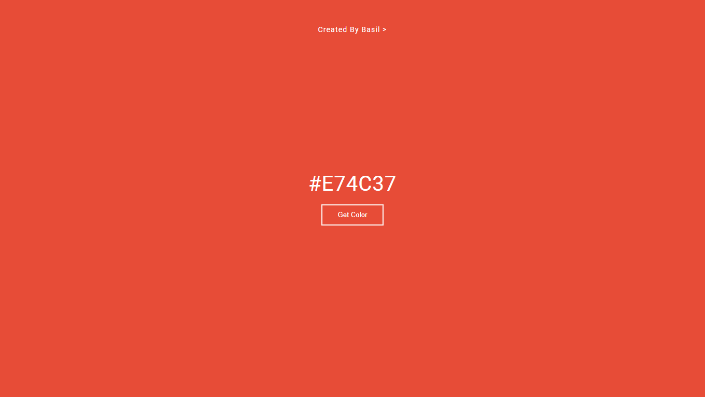

# Random-Color-Generator

 Simple Random Color Generator Using Html CSS And JavaScript Its Super Easy To Create 
 

## Preview

 
## Lesson

 I learnt from this javascript math function and events
 
## Demo

https://iambasilp.github.io/Random-Color-Generator/

## Support

For support, email basilxg321@gmail.com 

## Authors

- [@iambasilp](https://www.github.com/iambasilp)

